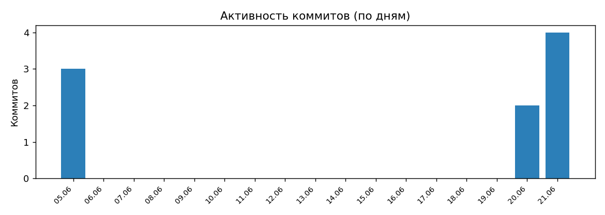
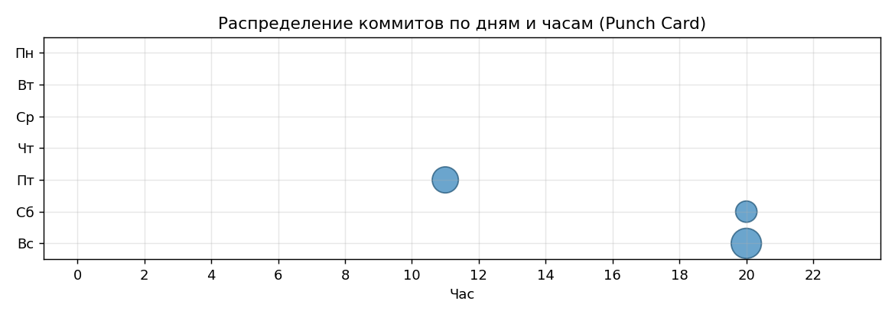

# Карачаевский язык в игровой форме — мобильное приложение

Курсовой проект по дисциплине «Программная инженерия» (СКФУ, 09.03.04).
**Траектория В: Мобильная разработка (React Native + Java Spring Boot).**

Мобильное приложение для изучения карачаевского языка через словесные игры:
**Сёздл**, **анаграммы**, **викторина**, **кроссворд**. Серверная часть хранит
словарь, проверяет ответы игр (защита от подсказок), формирует ежедневные задания
и лидерборд.

## Архитектура

Проект построен на паттерне **PCMEF** (Presentation → Control → Mediator → Entity → Foundation)
с направленностью зависимостей строго сверху вниз.

| Слой | Реализация |
|------|-----------|
| Presentation | React Native (TypeScript) + REST-контракт сервера |
| Control | Spring `@RestController` |
| Mediator | Spring `@Service` (бизнес-логика игр, транзакции) |
| Entity | JPA `@Entity` (доменные объекты с методами) |
| Foundation | Spring Data JPA репозитории + Data Mapper |

## Технологический стек

- **Клиент:** TypeScript, React Native, React Navigation, Axios, AsyncStorage
- **Сервер:** Java 17, Spring Boot 3, Gradle, Spring Data JPA, Spring Security + JWT, springdoc-openapi
- **БД:** PostgreSQL (3НФ), Flyway
- **Тесты:** JUnit 5, Mockito, JaCoCo

## Структура репозитория

```
.
├── server/     # Серверное приложение Spring Boot (PCMEF, REST API)
├── mobile/     # Мобильный клиент React Native
├── data/       # Словарь приложения
├── tools/      # Скрипты подготовки словаря
├── docker/     # Контейнеризация серверного стека
└── docs/       # Проектная документация по этапам (00–12)
```

## Словарь

Сервер хранит словарь карачаевского языка с переводами на русский. Длина слова
определяется токенизатором по карачаевскому алфавиту, в котором диграфы
(гъ, къ, нъ, нг, дж) считаются одной буквой; пятибуквенные слова используются
в игре «Сёздл». Начальный набор слов загружается миграцией Flyway при инициализации
базы данных, дальнейшее пополнение выполняется через административный CRUD словаря.

## Запуск

### Сервер

PostgreSQL и сервер поднимаются в Docker одной командой:

```bash
cd docker
docker compose up --build
```

Документация API (Swagger UI): `http://localhost:8137/swagger-ui.html`.

Для развёртывания с публичным HTTPS (PostgreSQL + сервер + Caddy с сертификатом
Let's Encrypt) используется `docker-compose.prod.yml`. Подробнее — в
[docker/README.md](docker/README.md).

### Клиент

Адрес сервера задаётся переменной `EXPO_PUBLIC_API_URL` в файле `mobile/.env`
(см. `mobile/.env.example`); значением выступает адрес развёрнутого сервера, что
позволяет работать из любой сети.

Запуск в режиме разработки (Expo):

```bash
cd mobile
npm install
npm run android        # либо npm start и сканировать QR в Expo Go
```

Сборка устанавливаемого APK (Expo Application Services):

```bash
cd mobile
eas build -p android --profile preview
```

Подробнее — в [mobile/README.md](mobile/README.md).

## REST API

Документация OpenAPI доступна в Swagger UI (`/swagger-ui.html`). Основные эндпоинты:

| Метод | Путь | Назначение | Доступ |
|-------|------|-----------|--------|
| POST | `/api/auth/register` | Регистрация | — |
| POST | `/api/auth/login` | Аутентификация (JWT) | — |
| GET | `/api/words` | Список слов (фильтр по длине/теме) | USER |
| POST/PUT/DELETE | `/api/words`, `/api/words/{id}` | CRUD словаря | ADMIN |
| GET | `/api/themes` | Темы | USER |
| GET | `/api/puzzles/daily` | Ежедневное задание Сёздл | USER |
| GET | `/api/puzzles/anagram`, `/quiz`, `/crossword` | Задания игр | USER |
| POST | `/api/games/sozdl/guess` | Проверка догадки Сёздл | USER |
| POST | `/api/games/{anagram,quiz,crossword}/answer` | Проверка ответа | USER |
| GET | `/api/leaderboard` | Рейтинг игроков | USER |
| GET | `/api/sessions/me` | История игр пользователя | USER |

Стандартные коды состояния: 200/201/400/401/403/404.

## Статистика разработки

> Финальные графики GitHub Insights добавляются на момент сдачи в `docs/images/`.

- Всего коммитов: _обновить при сдаче_
- Период разработки: _обновить при сдаче_




## Лицензия

Проект распространяется под лицензией MIT — см. [LICENSE](LICENSE).
