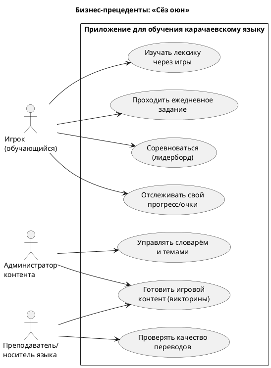
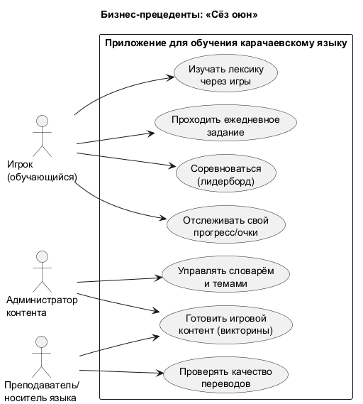

# Диаграмма бизнес-прецедентов (BUC)

Бизнес-прецеденты описывают, *что* система даёт бизнесу с точки зрения внешних
ролей (без деталей реализации). Системные Use Case детализируются на Этапе 1.

## Перечень бизнес-прецедентов

| ID | Бизнес-прецедент | Основная роль | Бизнес-ценность |
|----|------------------|---------------|-----------------|
| BUC-1 | Изучать лексику через игры | Игрок | Расширение словарного запаса в вовлекающей форме |
| BUC-2 | Проходить ежедневное задание | Игрок | Формирование привычки к регулярной практике |
| BUC-3 | Соревноваться в лидерборде | Игрок | Соревновательная мотивация, удержание |
| BUC-4 | Отслеживать прогресс и очки | Игрок | Ощущение продвижения |
| BUC-5 | Управлять словарём и темами | Администратор | Поддержание и рост качественного контента |
| BUC-6 | Готовить игровой контент | Администратор, Носитель | Наполнение викторин корректными вопросами |
| BUC-7 | Проверять качество переводов | Носитель языка | Достоверность лингвистических данных |

