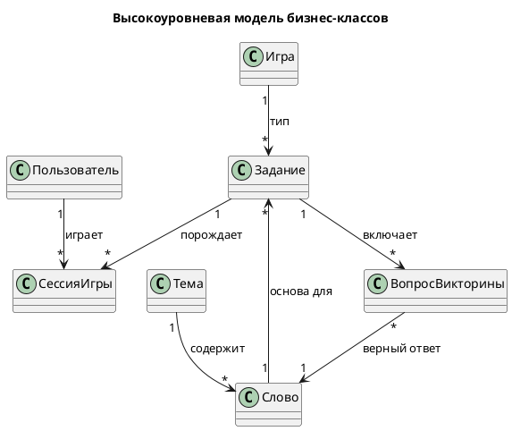

# Модель бизнес-классов (высокоуровневая)

Концептуальные сущности предметной области без атрибутов реализации.
На Этапе 1 уточняется в Domain Model, на Этапе 3 — в ER-модель.

## Описание сущностей

| Сущность | Назначение |
|----------|-----------|
| **Пользователь** | Игрок или администратор; владеет сессиями игр. |
| **Тема** | Тематическая группировка слов. |
| **Слово** | Словарная статья (карач. + перевод + длина). |
| **Игра** | Справочник типов игр (Сёздл / анаграмма / викторина / кроссворд). |
| **Задание** | Конкретный экземпляр игры (в т.ч. ежедневное). |
| **ВопросВикторины** | Вопрос с вариантами и верным ответом. |
| **СессияИгры** | Факт прохождения задания игроком с результатом и очками. |

> Лидерборд — не отдельная сущность, а агрегат над «СессияИгры».
> PNG-экспорт: `images/business-class-model.png`.
