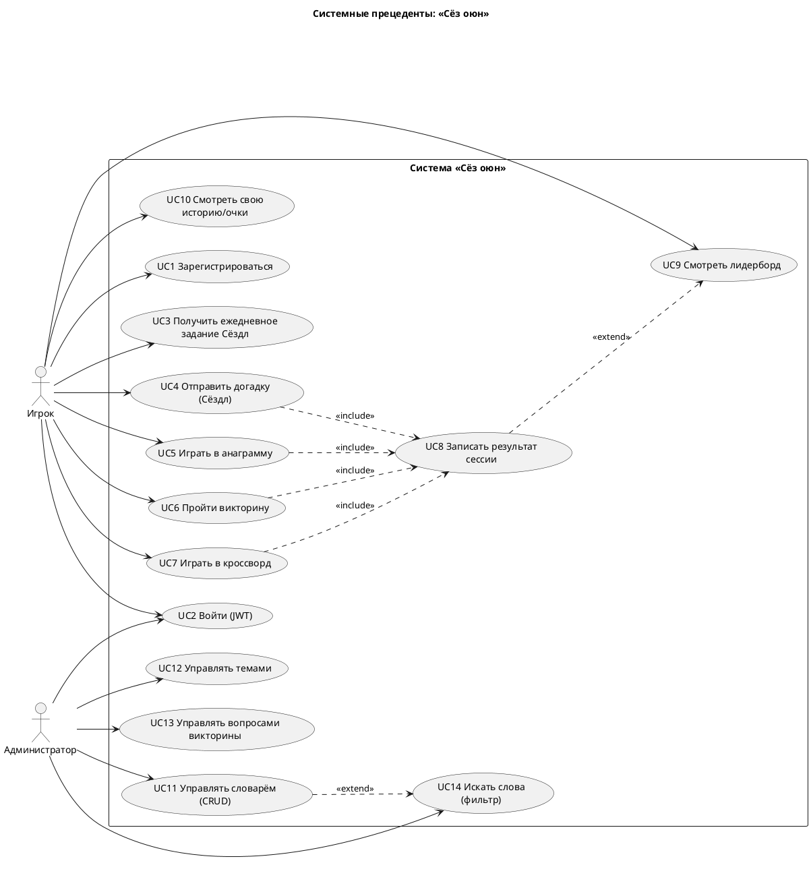
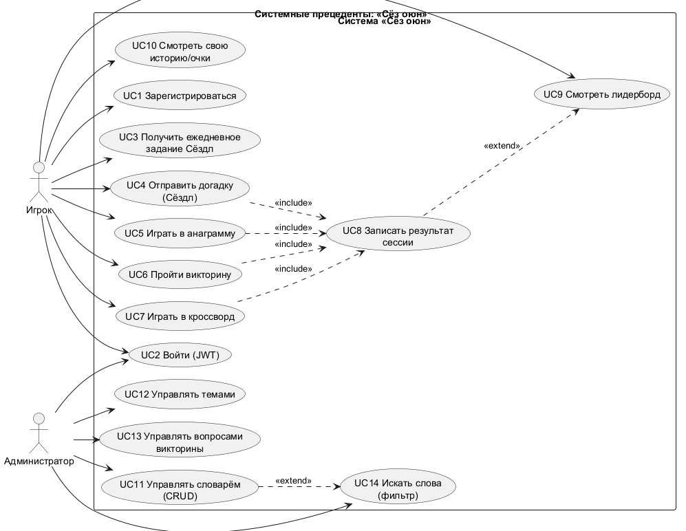

# Диаграмма системных прецедентов (Use Case)

Системные Use Case описывают функциональность системы (в отличие от бизнес-уровня
Этапа 0). Акторы - пользователи системы и внешние компоненты.

## Реестр прецедентов

| ID | Прецедент | Актор | Приоритет | Эндпоинт(ы) |
|----|-----------|-------|:---------:|-------------|
| UC1 | Регистрация | Игрок | High | `POST /api/auth/register` |
| UC2 | Вход (JWT) | Игрок, Админ | High | `POST /api/auth/login` |
| UC3 | Ежедневное задание Сёздл | Игрок | High | `GET /api/puzzles/daily?type=SOZDL` |
| UC4 | Отправить догадку Сёздл | Игрок | High | `POST /api/games/sozdl/guess` |
| UC5 | Анаграмма | Игрок | Medium | `GET /api/puzzles?type=ANAGRAM` |
| UC6 | Викторина | Игрок | Medium | `POST /api/games/quiz/answer` |
| UC7 | Кроссворд | Игрок | Low (stretch) | `GET /api/puzzles?type=CROSSWORD` |
| UC8 | Записать результат сессии | Игрок | High | `POST /api/sessions` |
| UC9 | Лидерборд | Игрок | High | `GET /api/leaderboard` |
| UC10 | История/очки игрока | Игрок | Medium | `GET /api/sessions/me` |
| UC11 | CRUD словаря | Админ | High | `GET/POST/PUT/DELETE /api/words` |
| UC12 | Управление темами | Админ | Medium | `GET /api/themes`, `POST/PUT/DELETE` |
| UC13 | Управление вопросами викторины | Админ | Medium | `/api/quiz-questions` |
| UC14 | Поиск слов с фильтром | Админ | Medium | `GET /api/words?theme=&length=` |
