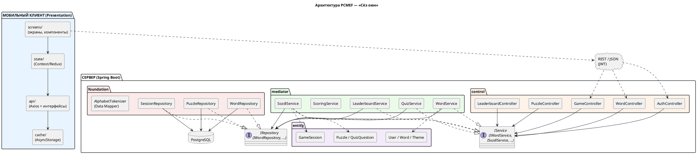

# Диаграмма пакетов (PCMEF)

Архитектура построена на паттерне PCMEF. Зависимости направлены **строго сверху
вниз**: Presentation → Control → Mediator → Entity → Foundation. Связь между
слоями — через интерфейсы (`IService`, `IRepository`).

## Распределение слоёв между клиентом и сервером

Presentation реализован на клиенте (React Native); Control/Mediator/Entity/Foundation —
на сервере (Spring Boot). Граница P↔C — REST/JSON.



## Соответствие пакетам Java

```
ru.skfu.langgame
├── control      # @RestController + DTO + обработка ошибок
├── mediator     # @Service (бизнес-логика, @Transactional) + интерфейсы IService
├── entity       # @Entity (доменные объекты с методами) + enum
├── foundation   # Spring Data JPA репозитории + мапперы (Data Mapper)
└── config       # SecurityConfig, OpenAPI, JWT-фильтр, инициализация seed
```

> PNG-экспорт: `diagrams/package-diagram-pcmef.png`.
