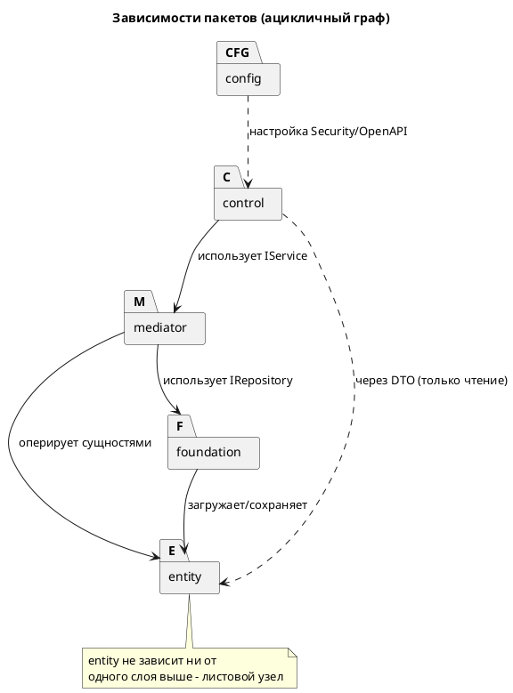
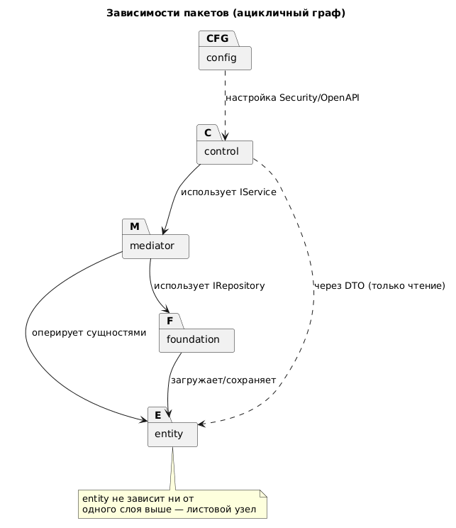

# Диаграмма зависимостей пакетов

Показывает направленность зависимостей между Java-пакетами сервера. Граф должен
быть **ацикличным** (требование PCMEF).

## Матрица зависимостей

| Из \ В | control | mediator | entity | foundation | config |
|--------|:-------:|:--------:|:------:|:----------:|:------:|
| **control** | - | ✅ (IService) | ✅ (DTO) | ❌ | ❌ |
| **mediator** | ❌ | - | ✅ | ✅ (IRepository) | ❌ |
| **entity** | ❌ | ❌ | - | ❌ | ❌ |
| **foundation** | ❌ | ❌ | ✅ | - | ❌ |
| **config** | ✅ | ✅ | ❌ | ✅ | - |

✅ - допустимая зависимость, ❌ - запрещена (нарушила бы направленность PCMEF).

## Контроль

- Циклы отсутствуют: `entity` - листовой узел, `control` - корневой (на сервере).
- На Этапе 6 проверяется статическим анализом (зависимости пакетов) и код-ревью.
- Нарушение направленности = штраф −20% по критериям методички.
