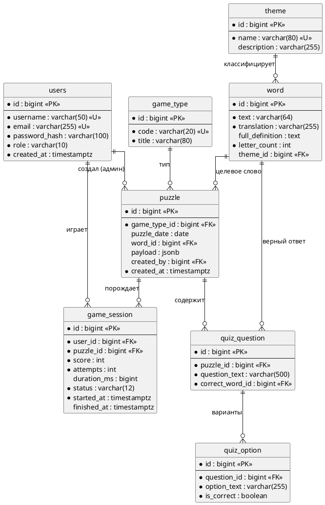
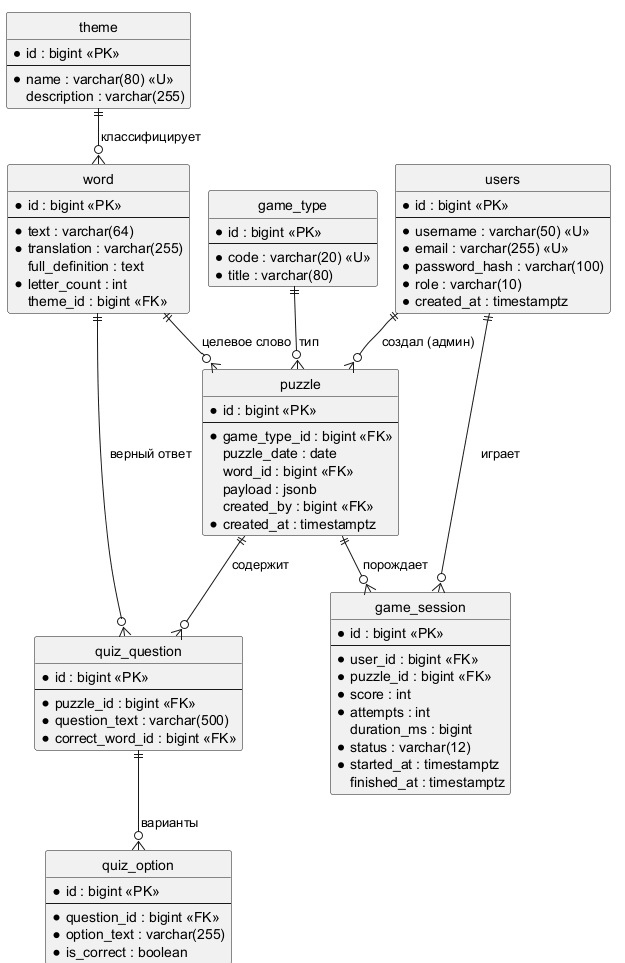

# ER-диаграмма (логическая модель данных)

Схема нормализована до **3НФ**: нет повторяющихся групп, все неключевые атрибуты
зависят от полного первичного ключа, транзитивные зависимости устранены
(в частности, тип игры у сессии не дублируется, а выводится через `puzzle`).

## Таблицы

| Таблица | Назначение | Кол-во записей (seed) |
|---------|-----------|----------------------|
| `users` | Игроки и администраторы | — (создаются при регистрации) |
| `theme` | Темы слов | 6 (V2) |
| `game_type` | Справочник типов игр | 4 (V2) |
| `word` | Словарь | 246 (V3) |
| `puzzle` | Задания | — (генерируются) |
| `quiz_question` | Вопросы викторины | — |
| `quiz_option` | Варианты ответа | — |
| `game_session` | Результаты игр | — |

