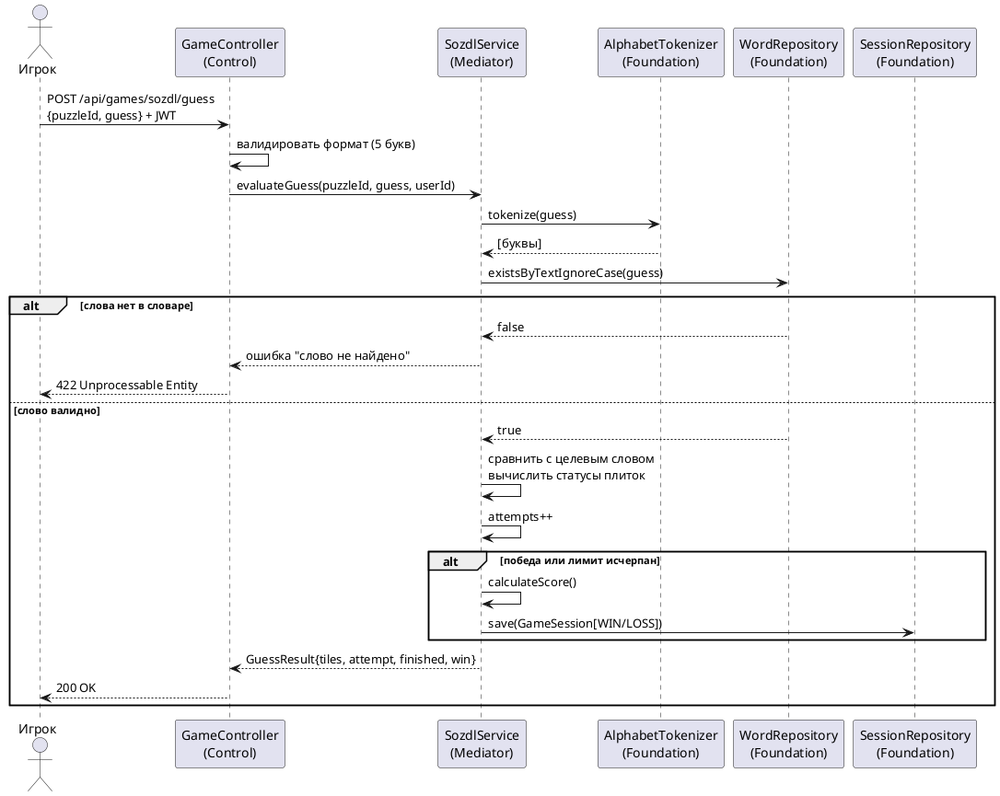
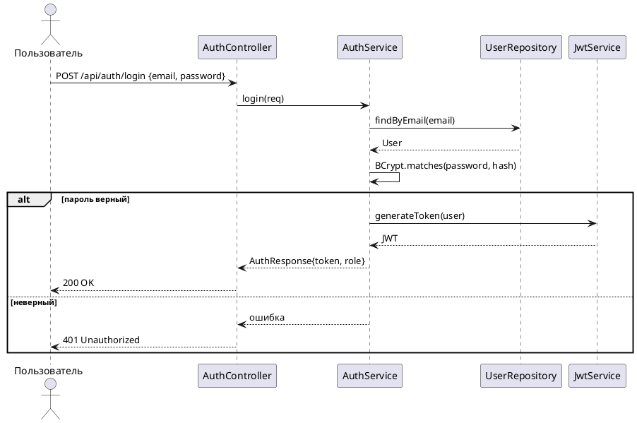
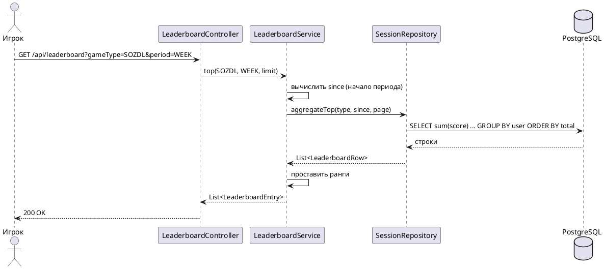

# Диаграммы последовательности

Ключевые сценарии, проходящие через все слои PCMEF.

## 1. Отправка догадки в Сёздл (UC4)

```plantuml
@startuml
actor Игрок
participant "GameController\n(Control)" as C
participant "SozdlService\n(Mediator)" as M
participant "AlphabetTokenizer\n(Foundation)" as T
participant "WordRepository\n(Foundation)" as WR
participant "SessionRepository\n(Foundation)" as SR

Игрок -> C : POST /api/games/sozdl/guess\n{puzzleId, guess} + JWT
C -> C : валидировать формат (5 букв)
C -> M : evaluateGuess(puzzleId, guess, userId)
M -> T : tokenize(guess)
T --> M : [буквы]
M -> WR : existsByTextIgnoreCase(guess)
alt слова нет в словаре
    WR --> M : false
    M --> C : ошибка "слово не найдено"
    C --> Игрок : 422 Unprocessable Entity
else слово валидно
    WR --> M : true
    M -> M : сравнить с целевым словом\nвычислить статусы плиток
    M -> M : attempts++
    alt победа или лимит исчерпан
        M -> M : calculateScore()
        M -> SR : save(GameSession[WIN/LOSS])
    end
    M --> C : GuessResult{tiles, attempt, finished, win}
    C --> Игрок : 200 OK
end
@enduml
```

## 2. Вход пользователя (UC2)

```plantuml
@startuml
actor Пользователь
participant "AuthController" as C
participant "AuthService" as M
participant "UserRepository" as R
participant "JwtService" as J

Пользователь -> C : POST /api/auth/login {email, password}
C -> M : login(req)
M -> R : findByEmail(email)
R --> M : User
M -> M : BCrypt.matches(password, hash)
alt пароль верный
    M -> J : generateToken(user)
    J --> M : JWT
    M --> C : AuthResponse{token, role}
    C --> Пользователь : 200 OK
else неверный
    M --> C : ошибка
    C --> Пользователь : 401 Unauthorized
end
@enduml
```

## 3. Получение лидерборда (UC9)

```plantuml
@startuml
actor Игрок
participant "LeaderboardController" as C
participant "LeaderboardService" as M
participant "SessionRepository" as R
database PostgreSQL as DB

Игрок -> C : GET /api/leaderboard?gameType=SOZDL&period=WEEK
C -> M : top(SOZDL, WEEK, limit)
M -> M : вычислить since (начало периода)
M -> R : aggregateTop(type, since, page)
R -> DB : SELECT sum(score) ... GROUP BY user ORDER BY total
DB --> R : строки
R --> M : List<LeaderboardRow>
M -> M : проставить ранги
M --> C : List<LeaderboardEntry>
C --> Игрок : 200 OK
@enduml
```
