# Этап 7 (часть 2). Мобильный интерфейс (React Native)

Presentation-слой PCMEF — мобильное приложение на **React Native + TypeScript**
(фреймворк Expo). Код в `mobile/`.

## Экраны (8, требование методички ≥5)

| Экран | Файл | Назначение |
|-------|------|-----------|
| Login/Register | `LoginScreen` | Вход и регистрация (JWT) |
| Home | `HomeScreen` | Меню выбора игры |
| Сёздл | `SozdlScreen` | Подсветка букв (диграфы = 1 плитка) |
| Анаграмма | `AnagramScreen` | Сбор слова из перемешанных букв |
| Викторина | `QuizScreen` | 4 варианта, подсветка верного |
| Кроссворд | `CrosswordScreen` | Заполнение по подсказкам |
| Рейтинг | `LeaderboardScreen` | Топ игроков (pull-to-refresh) |
| Профиль | `ProfileScreen` | История игр, очки, выход |

## Архитектура клиента

| Слой/модуль | Реализация |
|-------------|-----------|
| Состояние | Context API (`auth/AuthContext`) — аналог ViewModel |
| API-клиент | Axios + **JWT-интерсептор** (`api/client.ts`) |
| Навигация | React Navigation: стек игр + нижние табы |
| Оффлайн-кэш | AsyncStorage (`storage/cache.ts`, `withCache`) |
| Доменная утилита | `util/alphabet.ts` — токенизатор алфавита для плиток |

## Обработка состояний

Каждый игровой экран обрабатывает **загрузку / ошибку / пустоту** (индикатор,
сообщение об ошибке, повтор). JWT хранится в AsyncStorage, сессия восстанавливается
при перезапуске.

## Сетевое взаимодействие и оффлайн

- Все запросы идут через единый `http` (Axios) с автоподстановкой `Bearer`-токена.
- Daily-Сёздл кэшируется (`withCache`): при отсутствии сети возвращается последнее
  значение (оффлайн-режим), экран помечает данные как закэшированные.

## Запуск и проверка

- Инструкции: [`mobile/README.md`](../../mobile/README.md).
- Базовый URL сервера задаётся переменной `EXPO_PUBLIC_API_URL` (`mobile/.env`).
- **Проверка типов:** `npm run typecheck` (`tsc --noEmit`) — проходит без ошибок.
- Запуск: `npx expo start` (Expo Go) либо установка APK.

## Скриншоты

### Вход и регистрация
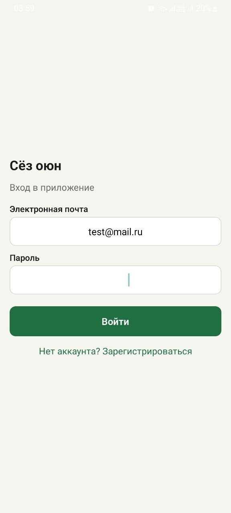
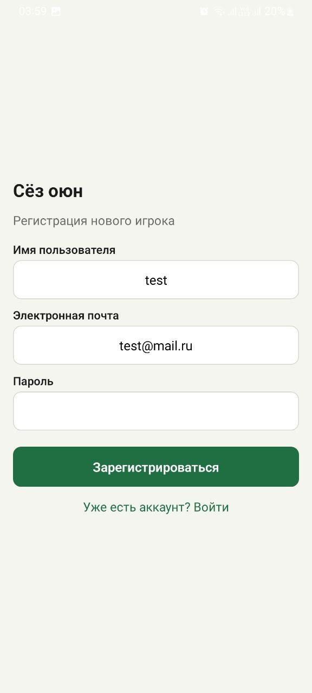

### Главное меню
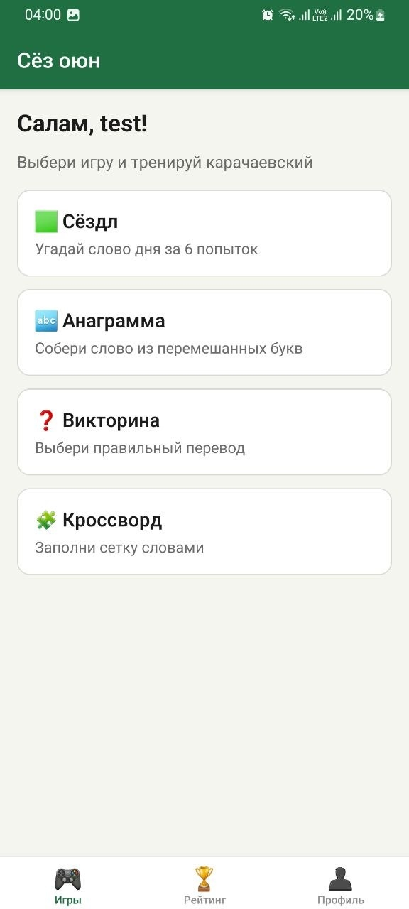

### Сёздл
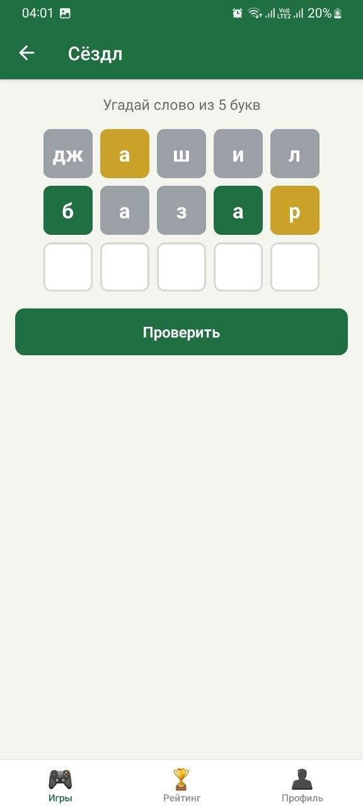
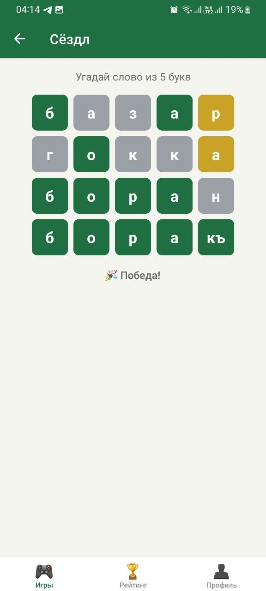

### Анаграмма
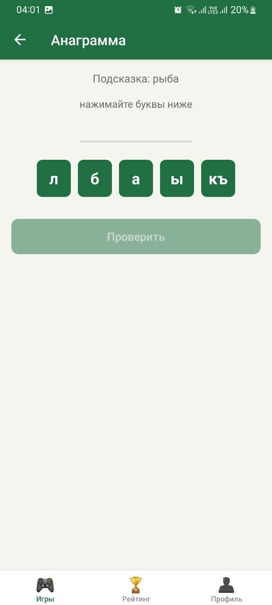
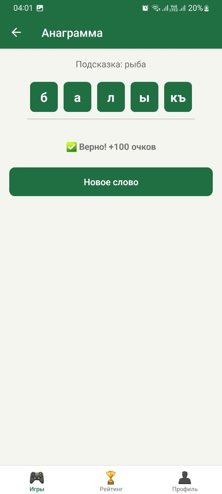
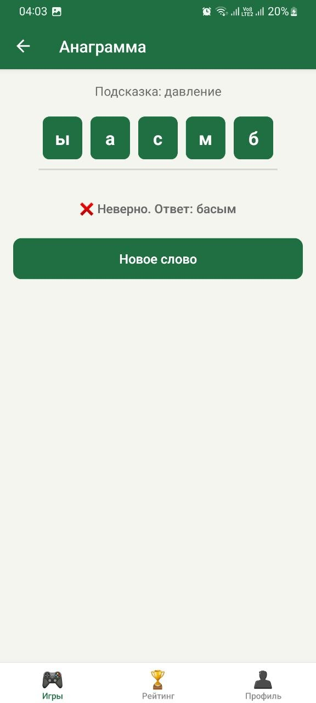

### Викторина
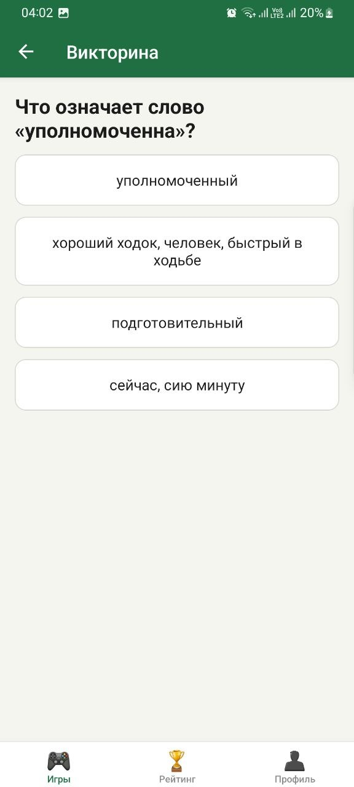
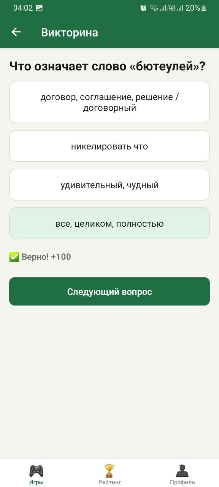
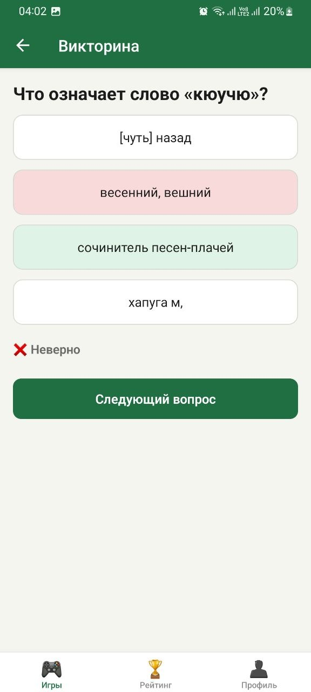

### Кроссворд
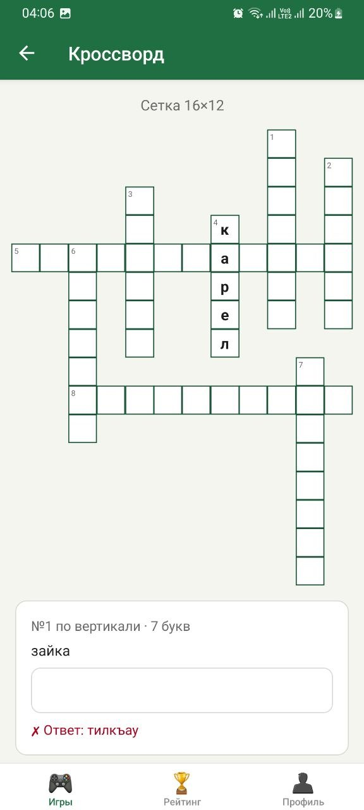
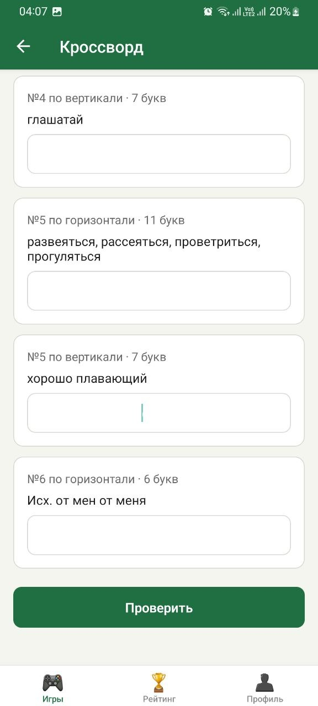
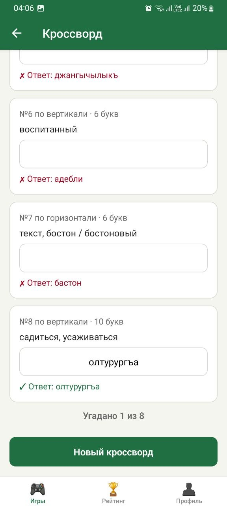

### Рейтинг и профиль
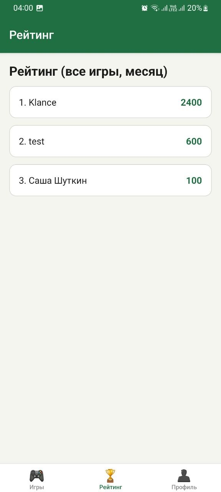
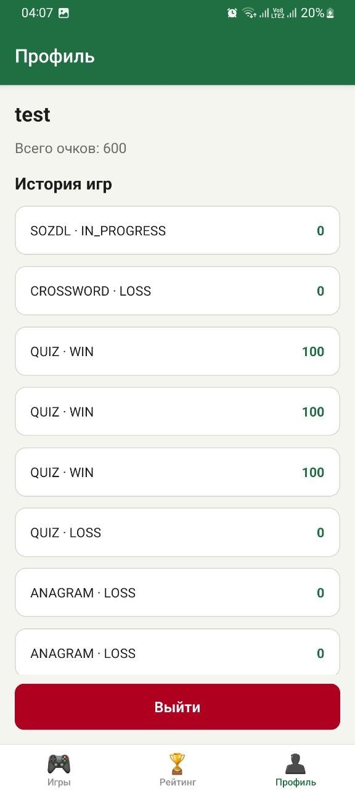
