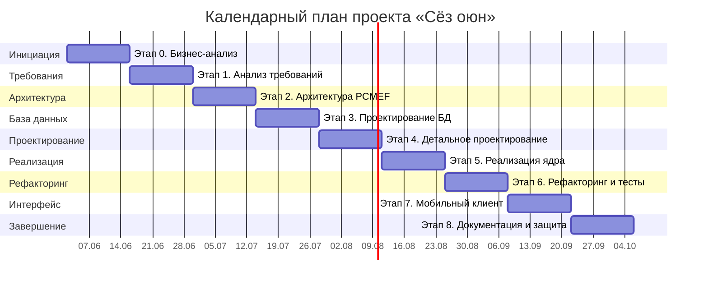

# Календарный план (диаграмма Ганта)

Период разработки — 18 недель (02.06.2026 – 06.10.2026), восемь этапов по две недели.

## 1. Диаграмма

## 2. Сроки этапов

| Этап | Содержание | Недели | Сроки | Вес |
|------|-----------|--------|-------|-----|
| 0 | Инициация и бизнес-анализ | 1-2 | 02.06 – 15.06 | 5% |
| 1 | Анализ требований | 3-4 | 16.06 – 29.06 | 10% |
| 2 | Архитектура | 5-6 | 30.06 – 13.07 | 10% |
| 3 | Проектирование базы данных | 7-8 | 14.07 – 27.07 | 10% |
| 4 | Детальное проектирование | 9-10 | 28.07 – 10.08 | 10% |
| 5 | Реализация ядра | 11-12 | 11.08 – 24.08 | 15% |
| 6 | Рефакторинг и тестирование | 13-14 | 25.08 – 07.09 | 10% |
| 7 | Реализация интерфейса | 15-16 | 08.09 – 21.09 | оценка траектории |
| 8 | Завершение | 17-18 | 22.09 – 06.10 | 15% |

## 3. Контрольные точки

| Контрольная точка | Срок |
|-------------------|------|
| Утверждённая архитектура и доменная модель | 13.07.2026 |
| Работающее ядро сервера с тестами (покрытие > 40%) | 24.08.2026 |
| Готовый мобильный клиент с интеграцией | 21.09.2026 |
| Полный комплект документации и презентация | 06.10.2026 |
